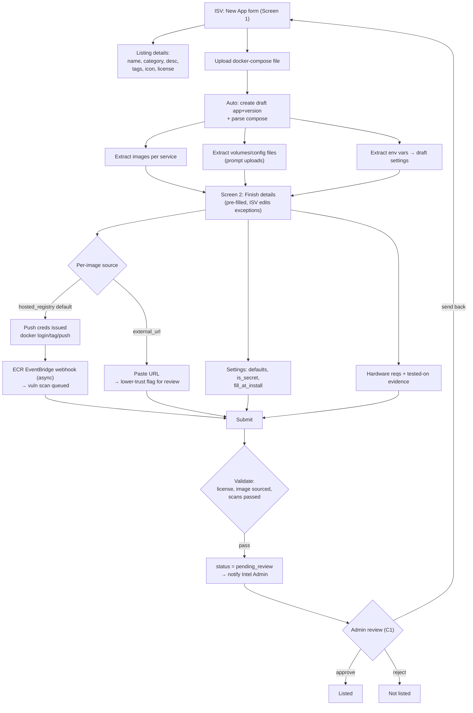
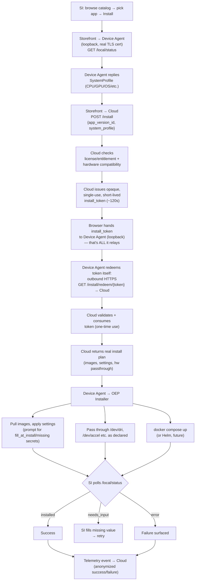

<!--
SPDX-FileCopyrightText: (C) 2026 Intel Corporation
SPDX-License-Identifier: Apache-2.0
-->

# Edge AI Catalog — Onboarding & Install Mind Maps

Companion quick-reference to `edge-ai-catalog-design.md` and
`technical-flows.md`. Use this doc to explain the two core flows at a
glance; refer to the linked docs for full API-level detail.

---

## 1. Onboarding (B1) — ISV, 2 screens

```
ISV Onboarding
├── Screen 1: "New App" form
│   ├── Listing details (name, category, desc, tags, icon, license)
│   └── Upload docker-compose file
│         └── (auto) create draft app+version → parse compose
│               ├── extract images per service
│               ├── extract volumes/config files → prompt uploads
│               └── extract env vars → draft "settings"
├── Screen 2: "Finish details" (pre-filled, ISV edits exceptions)
│   ├── Per-image source
│   │   ├── hosted_registry (default) → push creds → docker login/tag/push
│   │   │        → ECR EventBridge webhook (async) → vuln scan queued
│   │   └── external_url → paste URL → lower-trust flag for review
│   ├── Settings: default values, is_secret (*_TOKEN auto-flag), fill_at_install
│   ├── Hardware requirements (CPU/GPU/NPU/mem) + tested-on evidence upload
│   └── Submit → validate (license, image sourced, scans passed)
│         → status = pending_review → notify Intel Admin
└── Admin review (C1): approve → Listed | send back → ISV | reject
```

### Mermaid version (render in any Mermaid-capable viewer)



**Key mental hook:** ISV always builds/pushes their own image — catalog
never executes ISV build code (unlike an ESH/Jenkins build-from-source
pipeline). The 2-screen UX only collapses *screen count*, not the trust
boundary.

---

## 2. Install (D2) — SI, token-based, browser + Device Agent

```
SI Install (from Storefront, on the target device's browser)
├── Browse catalog → pick app → "Install"
├── Storefront calls Device Agent (loopback, real TLS cert) → GET /local/status
│     └── Device Agent replies its SystemProfile (CPU/GPU/OS/etc.)
├── Storefront → Cloud POST /install {app_version_id, system_profile}
│     ├── Cloud checks license/entitlement + hardware compatibility
│     └── Cloud issues opaque, single-use, short-lived install_token (~120s)
├── Browser hands install_token to Device Agent (loopback) — that's ALL it relays
├── Device Agent redeems token itself
│     └── outbound HTTPS GET /install/redeem/{token} → Cloud
│           ├── validates + consumes token (one-time use)
│           └── returns the real install plan (images, settings, hw passthrough)
├── Device Agent → hands plan to OEP Installer
│     ├── pulls images, applies settings (prompts for fill_at_install / missing secrets)
│     ├── passes through /dev/dri, /dev/accel etc. as declared
│     └── docker compose up (or Helm, future)
├── SI polls /local/status → "installed" | "needs_input" | "error"
└── Telemetry event → Cloud (install success/failure, anonymized)
```

### Mermaid version (render in any Mermaid-capable viewer)



**Key mental hook:** browser only ever relays an **opaque token**, never a
signed payload — Device Agent fetches the real install plan itself over its
own outbound call to the Cloud, using ordinary public-CA TLS. No custom
PKI/KMS signing or public-key provisioning to every device is needed.

---

## References
- Full API-level detail: `technical-flows.md` §B1 (onboarding), §D2
  (install).
- Architecture rationale: `edge-ai-catalog-design.md` §3 (install
  architecture), §4.3 (onboarding service), §4.5 (token model).
- Worked real-app example: `example-app-flow.md`
  (`smart-traffic-intersection-agent`).
